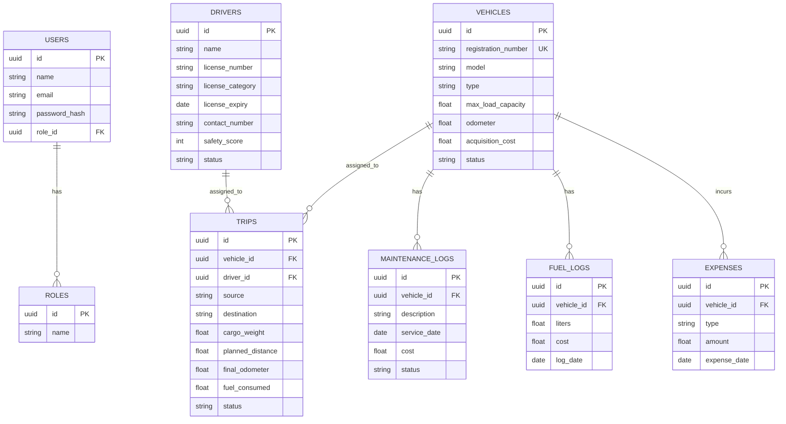
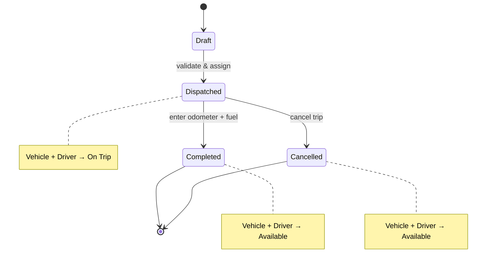

# 🚛 TransitOps — Smart Transport Operations Platform

<p align="center">
  
  
  
  
</p>

<p align="center">
  <b>A centralized platform to digitize vehicle, driver, dispatch, maintenance, fuel, and expense management for logistics fleets — replacing spreadsheets and manual logbooks with real-time, rule-enforced operations.</b>
</p>

---

## 📌 Table of Contents
- [🧭 Overview](#-overview)
- [❗ Problem Statement](#-problem-statement)
- [📊 Key Stats at a Glance](#-key-stats-at-a-glance)
- [👥 Target Users & Roles](#-target-users--roles)
- [✨ Core Features](#-core-features)
- [🏗️ System Architecture](#-system-architecture)
- [🗂️ Database Schema (ERD)](#-database-schema-erd)
- [⚖️ Business Rules Engine](#-business-rules-engine)
- [🔄 Trip Lifecycle](#-trip-lifecycle)
- [🧪 Example Workflow](#-example-workflow)
- [🛠️ Tech Stack](#-tech-stack)
- [📁 Project Structure](#-project-structure)
- [🚀 Getting Started](#-getting-started)
- [📐 Reports & Analytics Formulas](#-reports--analytics-formulas)
- [🌟 Bonus Features](#-bonus-features)
- [🎨 Design Mockup](#-design-mockup)
- [📄 License](#-license)

---

## 🧭 Overview
TransitOps is an end-to-end transport operations platform built to manage the complete lifecycle of a logistics fleet — from vehicle registration and driver onboarding to trip dispatch, maintenance tracking, fuel/expense logging, and operational analytics — all under strict, automatically-enforced business rules.

It is designed to be functional, rule-safe, and demo-ready for complete enterprise fleet management.

---

## ❗ Problem Statement
Many logistics companies still rely on spreadsheets and manual logbooks, which leads to:

| Pain Point | Impact |
| :--- | :--- |
| **Manual scheduling** | Double-booked vehicles & drivers |
| **No real-time visibility** | Underutilized fleet capacity |
| **Missed maintenance** | Higher breakdown risk & costs |
| **Expired licenses go unnoticed** | Compliance & safety violations |
| **Scattered expense data** | Inaccurate cost/profitability tracking |
| **No dashboards** | Poor operational decision-making |

TransitOps solves this with a single source of truth, automated status transitions, and validation rules baked directly into the workflow.

---

## 📊 Key Stats at a Glance

| Metric | Value |
| :--- | :--- |
| **Build timeline** | Production MVP |
| **User roles** | 4 (Fleet Manager, Dispatcher, Safety Officer, Financial Analyst) |
| **Core modules** | 8 (Auth, Dashboard, Vehicles, Drivers, Trips, Maintenance, Fuel/Expenses, Reports) |
| **Database entities** | 8 (Users, Roles, Vehicles, Drivers, Trips, Maintenance Logs, Fuel Logs, Expenses) |
| **Vehicle statuses** | 4 (Available, On Trip, In Shop, Retired) |
| **Driver statuses** | 4 (Available, On Trip, Off Duty, Suspended) |
| **Trip lifecycle stages** | 4 (Draft → Dispatched → Completed → Cancelled) |
| **Mandatory business rules enforced** | 10 |
| **KPI tiles on dashboard** | 7 |
| **Export formats** | CSV (mandatory), PDF (optional) |

---

## 👥 Target Users & Roles

| Role | Responsibility | Primary Modules Used |
| :--- | :--- | :--- |
| **🚦 Fleet Manager** | Oversees fleet assets, maintenance, and operational efficiency | Vehicle Registry, Maintenance, Dashboard |
| **🧑‍✈️ Dispatcher** | Creates trips, assigns vehicles/drivers, monitors active deliveries | Trip Management |
| **🛡️ Safety Officer** | Ensures compliance, tracks license validity & safety scores | Driver Management, Compliance Alerts |
| **💰 Financial Analyst** | Reviews expenses, fuel consumption, maintenance costs, profitability | Fuel & Expense Management, Reports |

Access is governed by Role-Based Access Control (RBAC) — each role sees only the modules and actions relevant to their function.

---

## 🔑 Demo Accounts

| Role | Email | Password |
| :--- | :--- | :--- |
| **Fleet Manager** | `fleet@transitops.com` | `password123` |
| **Dispatcher** | `driver@transitops.com` | `password123` |
| **Safety Officer** | `safety@transitops.com` | `password123` |
| **Financial Analyst** | `finance@transitops.com` | `password123` |

---

## ✨ Core Features

### 🔐 3.1 Authentication
- Secure email + password login
- Role-Based Access Control (RBAC)
- All routes protected — no unauthenticated access

### 📊 3.2 Dashboard
- Real-time KPIs: Active Vehicles, Available Vehicles, Vehicles in Maintenance, Active Trips, Pending Trips, Drivers On Duty, Fleet Utilization (%)
- Filters by vehicle type, status, and region

### 🚗 3.3 Vehicle Registry
- Master list with unique Registration Number, Model, Type, Max Load Capacity, Odometer, Acquisition Cost, Status
- Statuses: `Available` · `On Trip` · `In Shop` · `Retired`

### 🧑‍✈️ 3.4 Driver Management
- Profiles: Name, License Number, License Category, License Expiry, Contact, Safety Score, Status
- Statuses: `Available` · `On Trip` · `Off Duty` · `Suspended`

### 🗺️ 3.5 Trip Management
- Create trips with source, destination, vehicle, driver, cargo weight, planned distance
- Lifecycle: `Draft → Dispatched → Completed → Cancelled`

### 🔧 3.6 Maintenance
- Create maintenance records per vehicle
- Auto-switches vehicle status to `In Shop`, removing it from dispatch pool

### ⛽ 3.7 Fuel & Expense Management
- Fuel logs (liters, cost, date) + other expenses (tolls, maintenance)
- Auto-computed Total Operational Cost = Fuel + Maintenance per vehicle

### 📈 3.8 Reports & Analytics
- Fuel Efficiency, Fleet Utilization, Operational Cost, Vehicle ROI
- CSV export (mandatory) · PDF export (optional)

---

## 🏗️ System Architecture

```
┌──────────────────────────────────────────────────────────────────┐
│                          CLIENT (Web App)                         │
│   Responsive UI · RBAC-aware Views · Dashboard · Forms · Charts   │
└───────────────────────────────┬────────────────────────────────────┘
                                 │ REST / HTTPS
┌───────────────────────────────▼────────────────────────────────────┐
│                         APPLICATION LAYER                          │
│  Auth Service │ Vehicle Service │ Driver Service │ Trip Service    │
│  Maintenance Service │ Fuel & Expense Service │ Reports Service    │
│                        Business Rules Engine                       │
└───────────────────────────────┬────────────────────────────────────┘
                                 │
┌───────────────────────────────▼────────────────────────────────────┐
│                            DATA LAYER                               │
│   Users │ Roles │ Vehicles │ Drivers │ Trips │ Maintenance Logs     │
│                    Fuel Logs │ Expenses                            │
└──────────────────────────────────────────────────────────────────┘
```

---

## 🗂️ Database Schema (ERD)



---

## ⚖️ Business Rules Engine
All rules below are enforced server-side and cannot be bypassed via the UI:

| # | Rule |
| :--- | :--- |
| 1 | Vehicle registration number must be unique |
| 2 | `Retired` or `In Shop` vehicles never appear in dispatch selection |
| 3 | Drivers with expired licenses or `Suspended` status cannot be assigned to trips |
| 4 | A driver/vehicle already `On Trip` cannot be assigned to another trip |
| 5 | Cargo Weight must not exceed the vehicle's max load capacity |
| 6 | Dispatching a trip → vehicle and driver auto-set to `On Trip` |
| 7 | Completing a trip → vehicle and driver auto-reset to `Available` |
| 8 | Cancelling a dispatched trip → vehicle and driver restored to `Available` |
| 9 | Creating an active maintenance record → vehicle auto-set to `In Shop` |
| 10 | Closing maintenance → vehicle restored to `Available` (unless `Retired`) |

---

## 🔄 Trip Lifecycle



---

## 🧪 Example Workflow

| Step | Action | System Behavior |
| :--- | :--- | :--- |
| 1 | Register vehicle `Van-05`, max capacity 500 kg | Status = `Available` |
| 2 | Register driver `Alex` with valid license | Driver = `Available` |
| 3 | Create trip, Cargo Weight = 450 kg | Passes validation (450 ≤ 500) |
| 4 | Dispatch trip | Validated & allowed |
| 5 | Auto status update | Vehicle & Driver → `On Trip` |
| 6 | Complete trip (final odometer + fuel entered) | Trip closed |
| 7 | Auto status update | Vehicle & Driver → `Available` |
| 8 | Create maintenance record (Oil Change) | Vehicle → `In Shop`, hidden from dispatch |
| 9 | Reports refresh | Operational cost & fuel efficiency updated |

---

## 🛠️ Tech Stack

| Layer | Suggested Technology |
| :--- | :--- |
| **Frontend** | React 18 + Vite, React Router v6, Recharts, jsPDF |
| **Backend** | Node.js + Express.js |
| **Database** | PostgreSQL (local portable server) |
| **Auth** | JWT + bcrypt, RBAC middleware |
| **Styling** | Vanilla CSS (dark mode, glassmorphism) |

---

## 📁 Project Structure

```
odoo_virtual_1/
├── backend/                    # Node/Express backend app
│   ├── src/
│   │   ├── config/             # DB & Passport configuration
│   │   ├── controllers/
│   │   ├── middleware/         # Auth & RBAC guards
│   │   ├── routes/
│   │   └── index.js
│   └── package.json
├── frontend/                   # React/Vite frontend app
│   ├── src/
│   │   ├── api/
│   │   ├── components/
│   │   ├── context/
│   │   ├── pages/
│   │   ├── App.jsx
│   │   └── main.jsx
│   ├── index.html
│   └── package.json
├── setup-db.bat                # Windows DB setup script
└── README.md
```

---

## 🚀 Getting Started

### Prerequisites
- Node.js ≥ 18
- PostgreSQL 18 (Local portable setup included)
- npm or yarn

### 1. Start the PostgreSQL Database
Make sure your PostgreSQL database server is running. 

If using a standard PostgreSQL local installation on Windows/macOS/Linux:
- Ensure the server is active on port `5432` (or the custom port defined in your `.env` file).
- Configure the database name, username, and password inside `backend/.env` (default is `transitops`).

### 2. Backend Setup
Setup the environment variables, install dependencies, run migrations, and seed data:
```bash
# Navigate to the backend directory
cd backend

# Copy .env configuration
cp .env.example .env

# Install backend dependencies
npm install

# Run database migrations to create all tables
npm run migrate

# Seed the database with demo/test data
npm run seed

# Start backend on port 5000
npm run dev

### 3. Frontend Setup
Install dependencies and start the dev server:
```bash
# Navigate to the frontend directory
cd ../frontend

# Install frontend dependencies
npm install

# Start the Vite development server
npm run dev
```

### 4. Open the App
Visit **http://localhost:5173** and log in using one of the [Demo Accounts](#-demo-accounts).

---

## 📐 Reports & Analytics Formulas

| Metric | Formula |
| :--- | :--- |
| **Fuel Efficiency** | `Distance ÷ Fuel Consumed` |
| **Fleet Utilization (%)** | `(Vehicles On Trip ÷ Total Active Vehicles) × 100` |
| **Operational Cost** | `Fuel Cost + Maintenance Cost` (per vehicle) |
| **Vehicle ROI** | `(Revenue − (Maintenance + Fuel)) ÷ Acquisition Cost` |

---

## 🌟 Bonus Features
- PDF export
- Email reminders for expiring licenses
- Vehicle document management
- Search, filters, and sorting
- Dark mode

---

## 🎨 Design Mockup
The UI mockup/wireframes for this project are available here:
🔗 [Excalidraw Mockup](https://excalidraw.com)

> Add exported screenshots to `docs/` and embed them below once available:
> ```md
> )
> )
> ```

---

## 📄 License
This project is licensed under the MIT License — see the `LICENSE` file for details.

---
<p align="center">Built with ⚡ by the TransitOps Team</p>
